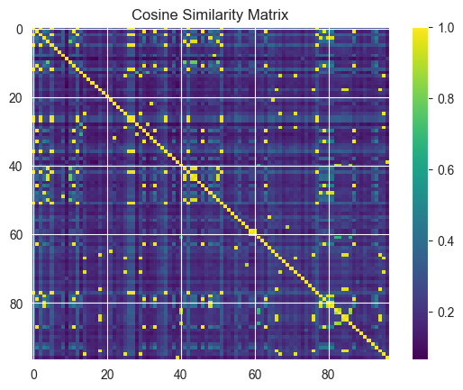

# Task 2: Data analyse
## Topic: Analysis of influence factors on content characteristics of quotes and tag content
## Introduction:
### 1. Content analysis:
Through the overall observation of the dataset, I became interested in the content characteristics of the quotes and the factors that produce the subheadings, and considered them valuable for analysis. In my analysis, I will analyze the characteristics of the quotes, including the length, tag information, sentiment, and the relationship between the quotes and their author, country, and generation. At the same time, in order to further analyze the emergence of these quotes, I will also analyze the relationship between the author of each quote and the national era, and explore what social background is more likely to produce the author of the quote.
### 2. Sentiment analysis:
Analyze the sentiment (positive, negative, neutral) of quotes and see if certain authors or countries tend to produce quotes with certain sentiments. Check whether certain labels are more associated with positive or negative emotions.

First, we get an overview of the dataset. Get and display the dataset, and output the total amount of data in the dataset. Check for null values and display rows and columns that contain null values.

After removing the null values, there are 97 records in the data.

To explore the authors of famous quotes by country, we need to keep only the author information and merge the authors with the same name.

#### We analyze the number of quotes for each country

In a comparative analysis of the number of authors' birthplaces, we can observe significant differences in the contributions of different countries to the realms of culture and knowledge. Firstly, the United States leads with 22 authors, reflecting its outstanding global standing in cultural and knowledge production. As a nation that attracts thinkers and creators from around the world, the United States exemplifies cultural diversity and innovation, making significant contributions to global literature and culture.

The United Kingdom follows closely with 9 authors, underscoring its rich literary traditions and cultural contributions. The UK has long been a cradle of literature, nurturing numerous distinguished writers who have had profound global influence.

Germany takes the third spot with 3 authors, signifying its significance in the cultural and knowledge domains. Germany boasts deep-rooted traditions in philosophy, literature, and music.

Other countries such as Ireland, Jamaica, France, and more each have their unique cultural attributes and contributions. While their numbers may be fewer, they have still left their mark on global literature and culture.

This comparative analysis highlights the cultural diversity and knowledge traditions of each country, emphasizing the richness of global literature and culture. Each nation holds an irreplaceable position in its respective field, collectively forming essential components of the diverse world culture.

#### We analyze the number of quotes for each continent

Europe emerges as the foremost contributor with 18 authors. This reflects its rich historical and cultural heritage, making it a powerhouse in global literature. European countries have nurtured countless influential writers and continue to shape the literary landscape.

North America is the second-largest contributor, with 4 authors. The United States, a dominant presence, plays a central role. Its cultural diversity and innovation have attracted talents worldwide, solidifying its place in the global literary scene.

South America, with a total of 2 authors, showcases its unique cultural diversity. Countries like Chile and Argentina bring a distinctive flavor to global literature, albeit in smaller numbers.

Asia, also with 2 authors, highlights the continent's untapped potential. Despite a modest count, Asia's rich cultural heritage holds promise for future contributions to global literature.

#### Next we will analyze the change in the number of authors in different decades

Average Birth Year: 1903.51

1770s-1840s: In the late 18th century and early 19th century, we see a relatively steady presence of authors, with a peak in the 1830s. This period witnessed significant cultural movements like the Romantic era and the Enlightenment. The number of authors in these decades reflects the literary and philosophical fervor of the time, with notable figures like Wordsworth, Coleridge, and Goethe.

1860s-1880s: The mid-19th century to late 19th century saw a resurgence in the number of authors, particularly in the 1870s. This aligns with the Victorian era, known for its prolific literary output and exploration of social and moral issues. The works of authors like Dickens, Austen, and Tolstoy gained prominence.

1890s-1920s: The late 19th century into the early 20th century marked a significant increase in the number of authors, peaking in the 1920s. This period encompassed the transition from the Victorian era to the Modernist era. It witnessed profound shifts in literature, with authors like James Joyce, Virginia Woolf, and Franz Kafka challenging traditional narrative structures and embracing experimentation.

1930s-1940s: The 1930s saw a slight dip in author counts, while the 1940s witnessed a resurgence. This period corresponds to the impact of World War II and the aftermath. The focus on wartime experiences and societal changes influenced literary works during this time.

1950s-1970s: The 1950s had a lower number of authors, suggesting a shift towards a more selective literary landscape. The 1960s saw another resurgence, aligning with the counterculture movements and societal changes of the time. It was a period of literary experimentation and exploration, with authors like Kerouac, Ginsberg, and Plath.

In summary, the analysis reveals a correlation between the number of authors born in specific decades and the prevailing cultural, historical, and social dynamics. It highlights the impact of various literary movements and global events on the output of authors during different periods. The ebb and flow of author counts by decade reflect the ever-evolving landscape of literature and its deep connection to the spirit of the times.

#### Next, we looked at the generation and country of birth to determine what makes a famous author more likely

    

After analyzing the data, we can observe a large number of famous quote authors for some specific eras and countries. Let us analyze these phenomena in the context of history and what kind of background is easier to cultivate famous writers:

## Germany in the 1870s:
During the construction of the German Empire, many outstanding thinkers and writers appeared in the field of culture and philosophy, such as Nietzsche, Goethe, Yost, Freud, etc. The intellectual and cultural prosperity of this period provided the soil for the emergence of famous writers.

## Britain in the 1960s and 1770s:
Britain experienced a cultural boom in both periods. In the 1770s, literary giants such as Shakespeare, Burke, and Johnson produced many famous quotes. In the 1960s, Britain set off a musical and cultural revolution. The prosperity of the Beatles and the cultural industry gave rise to many innovations and famous quotes.

## The United States in the late 1940s and the 1920s and the 1900s:
these epochs represent different periods of history. In China, the United States was experiencing the Romantic movement, which produced important thinkers such as Emerson and Thoreau. The 1940s was the period of World War II, the world was full of wars and changes, and this environment may have inspired the quote. The 1920s marked the Jazz Age, with literary and cultural innovations such as the works of Fitzgerald. The 1900s represented the historical events and cultural movements of the 20th century.

In general, the prosperity of The Times, cultural changes, historical events and innovation of ideas usually create the conditions for the emergence of famous writers. These periods provided a wealth of material and ideas that inspired people to produce distinctive quotes. Each era has its own unique influence factors, which have a profound impact on the generation of famous quote authors.

#### In the next section, we will analyze whether there is a relationship between quote length and author, country, or label. For example, do certain authors tend to write longer or shorter citations? Or are certain tags associated with longer references?

From the above results, we can see that the length of a quote is closely related to the author of the quote. Marilyn Monroe, Pablo Nenuda, and Bob Marley are particularly prominent, and most of the quotes created by these people are longer sentences. At the same time, the difference of the topic also seriously affects the length of the quote. The quotes about sister and heartbreak are long but rare and appear in the same article, while the quotes about friends and love are numerous and of considerable length. There are also many famous sayings about life, writing, philosphy and library, which are relatively short in length and can be expressed more concisely.

#### Next we analyze if there are patterns in the tags that are associated with a particular country or author

From the above chart analysis, it can be concluded that the country and the author themselves have a hugeimpact on the labeling of the content of the quote. There are a large number of famous quotes about humor, books, inspirational, life, love and reading in America and Britain only, which may be influenced by the social conditions and cultural traditions of the countries and people's life attitudes.
Similarly, we find that some authors are due to their unique experience and the historical background of the social period in which they live. Mariyn Monroe wrote about love, humor, and attributed no-source. Mark Twain wrote about life, reading, and friends. It can be seen that people with different living environments have a deep understanding of a series of specific topics and can produce more.

#### Next we analyze the frequency of occurrence of tags and tags with more occurrences in different countries

    

From the above analysis, we can observe that there are a large number of subheadings related to "love," "inspirational," "life," "humor," "books," and "reading" in British and American quotes. This may reflect the prosperity of these countries in the literary and social fields, as well as the wide discussion and attention to these topics.

Love: The appearance of this theme may reflect the continuous attention and discussion of love in the culture and literature of these countries.

Inspirational: This may reflect the tendency of British and American quotes to convey messages that inspire and motivate others, which may be related to the literary and oratory traditions of these two countries.

Life: This reflects the thought and reflection on all aspects of life in the quote, which is a widely discussed topic in any country.

Humor: This suggests that humorous elements in British and American literature are prominent in quotes.

Books: The discussion of books may reflect the cultural emphasis on reading and literature in both countries.

Reading: Reading is seen as an important form of knowledge acquisition in both countries.

"friendship", "truth", "writing" and "death" were among the most popular themes. These topics are also deeply concerned by authors and readers, and may reflect people's concerns and thinking about these important aspects of life.

These findings can help us better understand important themes in British and American culture and how these themes are reflected in quotes. This can also provide interesting clues for further in-depth research.

## Word clouds analyze the content of quotes
After the above analysis, I think it is necessary to focus on the analysis of the content of each quote to understand the central point of the whole quote in the data set. At the same time, it is necessary to analyze the commonly used words of the author to explore whether there is a certain connection with the era background of the author. Word clouds are generated for the entire dataset and then the most prominent words or topics are visualized for a particular author or tag.

Through word cloud analysis, we can see that some high-frequency words such as "will," "love," "life," "truth," "book," "live," "give," "think," and "friend" appear more frequently. This may reflect the topic and sentiment tendencies of the quotes in the dataset.

"Will" may be related to determination, willingness, or strength of will, themes that may have been explored in quotes.
"Love" and "life" are very common topics, and they usually refer to emotions, relationships, and life experiences.
"Truth" may reflect the quest for truth and wisdom that is common in philosophical or illuminating quotes.
"Book" may be related to knowledge, education, or culture, and may refer to literary works in quotes.
"Friend" indicates that friendship and relationships are also common themes.
The presence of these high-frequency words may reflect some universal, human themes in the quotes, such as love, truth, life and friendship. These words may be a manifestation of important concepts in the author and quote, or they may reflect the universality and resonant power of the quote.

    

    

    

    

Based on the analysis of the high-frequency words in the quotes of Albert Einstein, J.K. Rowling and Mark Twain, it is possible to try to combine their background, country and era to understand why these particular words occur frequently in their quotes.

### Albert Einstein:
He was a famous physicist, so "miracle" and "thinking" may be related to his strong interest in science and thinking. His famous theory of relativity has a wide influence in the field of physics.
"music" probably reflects his love of music. He has said that music has had a positive impact on his scientific work.
"live" and "life" are related to philosophy of life and outlook on life, which may reflect his thinking on life and human values.

### J.K. Rowling:
As the author of the harry Potter series of novels, "harry" is obvious because it is the name of the main character.
"pity" and "choice" may be related to moral decision making and compassion in fiction.
"stand" and" great" may be related to the novel's themes of courage, persistence, and greatness.

### Mark Twain:
He is an important writer in American literature, and "book" and "truth" may be related to his literary works and the pursuit of truth.
"life" and "people" are generic themes that may refer to his insights on society and human nature.
"fear" may be related to his critique of society and culture.

These high-frequency words reflect the author's interests, important topics and cultural background in their quotes. At the same time, the author's country, age and personal experience can also have a profound impact on their work.

After analyzing the relationship between the individual and the content of the quote, in order to understand the relationship between the life background and the content of the quote, whether there is a certain correlation between the content. After removing adjectives that affect the analysis, some words that indicate emotion and frequency, we try to retain verbs and nouns with research significance. Text analysis of the content of the author's description and quote was performed to see if there were commonly used words or themes in the author's description and quote. For example, if an author's description mentions "war", do their citations also reflect themes of conflict, peace, or struggle?
In the analysis process, using nlp techniques, the text is analyzed to extract keywords and topics, which are analyzed using TF-IDF or cosine similarity methods to determine which words or topics co-occur frequently in descriptions and references.

    

    

    

Through the analysis results of cosine similarity and text similarity matrix, we can see that there is a great correlation between the content of the quote and the description of the quote author. It can be seen that the author's life background and life experience will have a great influence on the theme and content of the quote. Some special experiences, such as life and death, unforgettable love, obstacles to the pursuit of truth, Will lead to the generation of relevant quotes. At the same time, through the observation of the word cloud map, we can find that some experiences or topics are easier to appear synchronously than other topics, which is more likely to lead to the emergence of the same topic, such as love, life, truth, which is a great spiritual touch experience, or some topics that are often discussed by people, such as friends, life, data, etc.

#### In the process of analysis, I found that the number of occurrences of themes in each era can be used to infer hot topics. Assuming that the frequency of occurrence of a quoted tag represents its popularity or relevance in social discussions in the era (when the author was born), we can analyze which topics or topics resonate most with people in which era.
                                        0              1                     2
    1770                            books          humor                  love
    1800                        happiness           life               regrets
    1810                    inspirational           None                  None
    1820        misattributed-to-einstein           None                  None
    1830                            books           life                 truth
    1840                           edison        failure         inspirational
    1850                    inspirational           life              yourself
    1860                             love           life             adventure
    1870                             life         change         deep-thoughts
    1880  misattributed-eleanor-roosevelt     attributed                  fear
    1890                            books           fate                  life
    1900                          fantasy           love                poetry
    1910                            books        writing  attributed-no-source
    1920                             love  inspirational                 humor
    1930                            humor       insanity                  lies
    1940                            humor        reading                 books
    1950                             life     navigation                  None
    1960                       dumbledore      abilities               choices
    1970                             drug        romance                simile
    

Based on the table obtained from the above analysis results, we can clearly get the ranking of the most popular topics in each era, and screen out the most popular topics in that era. Combined with the historical description, we can have a clearer understanding of the social background of that era.

#### Finally, I will analyze the sentiment contained in each quote. Analyze the sentiment (positive, negative, neutral) of quotes, and then analyze whether certain authors or countries tend to produce quotes with specific sentiments. Check whether certain labels are more associated with positive or negative emotions

1. Introduction Sentiment Analysis:
The sentiment score of each utterance is calculated and classified as positive, negative or neutral.
The TextBlob library is used, which provides the polarity score for a given text data. polarity score is a floating point value in the range [-1.0,1.0](tuples for polarity and subjectivity)
A score close to 1 means positive.
A score closer to -1 means it's negative.
A score around 0 means neutral.
To classify sentiment as "positive," "negative," or "neutral," thresholds are defined:
• If the polarity score is greater than 0.05, it is classified as positive.
• If the polarity score is less than -0.05, it is classified as negative.
• If polarity score is between -0.05 and 0.05 inclusive, it is classified as neutral.
These thresholds were chosen to provide a small buffer around 0 for neutral emotions, ensuring that only strong positive or negative emotions are classified. Adjusting these thresholds can provide finer or coarser classifications depending on the specific needs of the analysis.

2. Group the data by author and sentiment and display the top-ranked authors according to the sentiment distribution.
3. Group the data by country and sentiment and show the top countries according to the sentiment distribution.
4. Analyze the sentiment distribution of specific tags and display the top ranked tags based on the sentiment distribution. Determine whether certain labels are positive or negative dominant.

    

1. J.K. Rowling has produced 6 positive, 2 negative, and 1 neutral sentiment quotes.
2. Marilyn Monroe has produced 5 positive, 1 negative, and 1 neutral sentiment quotes.
3. Albert Einstein has produced 5 positive and 5 neutral sentiment quotes.
4. Other authors like Dr. Seuss, Jane Austen, and Bob Marley also show a high number of positive sentiment quotes.

1. The tag "love" has 4 quotes with positive sentiment.
2. "attributed-no-source" has 3 positive sentiment quotes.
3. "music" has 2 positive sentiment quotes.
4. The tag "inspirational", interestingly, has 2 negative and 1 positive sentiment quotes.

## The following is an analysis of the above results:

### Author Sentiment Analysis:
The data has been grouped by author,  and the sentiment of the quotes associated with each author has been categorized as "negative," "neutral,"  or "positive."
J.K. Rowling, Marilyn Monroe,  and Albert Einstein have the highest count of positive sentiment quotes. This suggests that they are associated with  more optimistic or uplifting quotes.
J.K. Rowling stands out as the author with the highest count of positive sentiment quotes,  indicating that her quotes tend to be positive.

### Country Sentiment Analysis:
The data has been grouped by the country of the author,  and the sentiment of quotes from authors in each country has been categorized.
The United States has the highest count of positive sentiment quotes, followed by the United Kingdom.
This could imply that quotes from authors in the United States and the United Kingdom tend to have a more positive tone.  The "in The United States" category might include authors who were based in the United States.
Jamaica and Ireland also have a positive sentiment count,  which suggests that authors from these countries contribute positively as well.

### Tag Sentiment Analysis:
The data has been expanded to analyze individual tags associated with quotes and their sentiment.
Tags like "love," "attributed-no-source," and "music" have the highest count of positive sentiment quotes.
Tags "inspirational" and "elizabeth-bennet, jane-austen" also have a positive sentiment.
The "love" tag is associated with the highest count of positive sentiment quotes. This suggests that quotes related to  love are often positive in nature.

Overall, the sentiment analysis provides insights into which authors, countries, and tags are associated with positive,  neutral,  or negative sentiment quotes. This information can be valuable for understanding the emotional content of quotes in the  dataset and for various applications such as content curation or sentiment-based recommendation systems.

In this comprehensive analysis, we delve into many aspects of the quotes, such as the content, the era context, the author's experience, and the sentiment analysis. We found some interesting trends and conclusions.

First of all, the content of the quote covers a variety of topics, but themes such as "love", "inspiration" and "music" often appear to inject a positive sentiment into the quote. This may reflect a common desire to find inspiration and express emotions in different eras.

Secondly, the influence and emotional color of different authors vary. J.K. Rowling stands out for her positive emotional quotes, which are closely related to her writing and success stories. Marilyn Monroe's quotes also have a positive sentiment, reflecting her legendary life.

What's more, different countries have different expressions of emotion in their quotes. American and British authors tend to be more positive, while Jamaican and Irish authors also inject positive sentiment into their quotes, reflecting the cultural characteristics of each country.

Taken together, this analysis reveals profound connections between quotes and authors, countries, and topics. This helps us better understand the value and meaning of quotes and how they reflect the emotions and experiences of different times and authors.