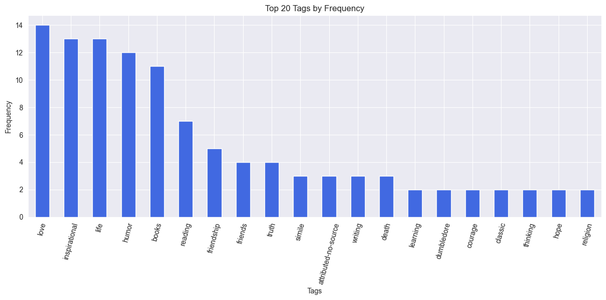

## First, I add error detection to prevent errors in the crawling process from affecting the results. Check the next button to see if there is still data to fetch. This code doesn't use a traditional progress bar, because we're constantly checking to see if we still have the next page of information to crawl, and we're constantly giving hints as we go along.

# Data analyse
## Topic: Analysis of influence factors on content characteristics of quotes and tag content
## Introduction:
### 1. Content analysis:
Through the overall observation of the dataset, I became interested in the content characteristics of the quotes and the factors that produce the subheadings, and considered them valuable for analysis. In my analysis, I will analyze the characteristics of the quotes, including the length, tag information, sentiment, and the relationship between the quotes and their author, country, and generation. At the same time, in order to further analyze the emergence of these quotes, I will also analyze the relationship between the author of each quote and the national era, and explore what social background is more likely to produce the author of the quote.
### 2. Sentiment analysis:
Analyze the sentiment (positive, negative, neutral) of quotes and see if certain authors or countries tend to produce quotes with certain sentiments. Check whether certain labels are more associated with positive or negative emotions.

# First, we get an overview of the dataset. Get and display the dataset, and output the total amount of data in the dataset. Check for null values and display rows and columns that contain null values.


```python
import pandas as pd
import matplotlib.pyplot as plt
# read data from CSV file
data = pd.read_csv('Songming_Ping+2033685.csv')

print(data)
# Get the total number of entries
total_rows = len(data)

# check for null values
null_values = data.isnull()

# Show rows and columns containing null values
null_rows = null_values[null_values.any(axis=1)]
null_columns = null_values.columns[null_values.any()]

# Print the total entries
print(f"The data has a total of {total_rows} records.")

# If there is a null value, print the row and column containing the null value
if not null_rows.empty:
    print("Rows containing null values:")
    print(null_rows)
if not null_columns.empty:
    print("Columns containing null values:")
    print(null_columns)
```

                                           Quotes Content  \
    0   “The world as we have created it is a process ...   
    1   “It is our choices, Harry, that show what we t...   
    2   “There are only two ways to live your life. On...   
    3   “The person, be it gentleman or lady, who has ...   
    4   “Imperfection is beauty, madness is genius and...   
    ..                                                ...   
    95  “You never really understand a person until yo...   
    96  “You have to write the book that wants to be w...   
    97  “Never tell the truth to people who are not wo...   
    98        “A person's a person, no matter how small.”   
    99  “... a mind needs books as a sword needs a whe...   
    
                                                     Tags              Author  \
    0              change, deep-thoughts, thinking, world     Albert Einstein   
    1                                  abilities, choices        J.K. Rowling   
    2        inspirational, life, live, miracle, miracles     Albert Einstein   
    3                    aliteracy, books, classic, humor         Jane Austen   
    4                          be-yourself, inspirational      Marilyn Monroe   
    ..                                                ...                 ...   
    95                                better-life-empathy          Harper Lee   
    96  books, children, difficult, grown-ups, write, ...   Madeleine L'Engle   
    97                                              truth          Mark Twain   
    98                                      inspirational           Dr. Seuss   
    99                                        books, mind  George R.R. Martin   
    
       Birthday of the author Country of the author  \
    0          March 14, 1879               Germany   
    1           July 31, 1965    The United Kingdom   
    2          March 14, 1879               Germany   
    3       December 16, 1775    The United Kingdom   
    4           June 01, 1926  in The United States   
    ..                    ...                   ...   
    95         April 28, 1926     The United States   
    96      November 29, 1918     The United States   
    97      November 30, 1835     The United States   
    98         March 02, 1904     The United States   
    99     September 20, 1948     The United States   
    
                                Description of the author  
    0   In 1879, Albert Einstein was born in Ulm, Germ...  
    1   See also: Robert GalbraithAlthough she writes ...  
    2   In 1879, Albert Einstein was born in Ulm, Germ...  
    3   Jane Austen was an English novelist whose work...  
    4   Marilyn Monroe (born Norma Jeane Mortenson; Ju...  
    ..                                                ...  
    95  Harper Lee, known as Nelle, was born in the Al...  
    96  Madeleine L'Engle was an American writer best ...  
    97  Samuel Langhorne Clemens, better known by his ...  
    98  Theodor Seuss Geisel was born 2 March 1904 in ...  
    99  George R. R. Martin was born September 20, 194...  
    
    [100 rows x 6 columns]
    The data has a total of 100 records.
    Rows containing null values:
        Quotes Content  Tags  Author  Birthday of the author  \
    27           False  True   False                   False   
    42           False  True   False                   False   
    78           False  True   False                   False   
    
        Country of the author  Description of the author  
    27                  False                      False  
    42                  False                      False  
    78                  False                      False  
    Columns containing null values:
    Index(['Tags'], dtype='object')
    


```python
# Delete rows with null values because all missing columns are critical tag columns
# Delete rows with null values
data = data.dropna()

# Print the total number of records after removing the null values
print(f"After removing the null values, there are {len(data)} records in the data.")
```

    After removing the null values, there are 97 records in the data.
    


```python
# Let's take a quick look at the data.
# Show the first few rows of the dataset to see how the data is styled
print(data.head())
```

                                          Quotes Content  \
    0  “The world as we have created it is a process ...   
    1  “It is our choices, Harry, that show what we t...   
    2  “There are only two ways to live your life. On...   
    3  “The person, be it gentleman or lady, who has ...   
    4  “Imperfection is beauty, madness is genius and...   
    
                                               Tags           Author  \
    0        change, deep-thoughts, thinking, world  Albert Einstein   
    1                            abilities, choices     J.K. Rowling   
    2  inspirational, life, live, miracle, miracles  Albert Einstein   
    3              aliteracy, books, classic, humor      Jane Austen   
    4                    be-yourself, inspirational   Marilyn Monroe   
    
      Birthday of the author Country of the author  \
    0         March 14, 1879               Germany   
    1          July 31, 1965    The United Kingdom   
    2         March 14, 1879               Germany   
    3      December 16, 1775    The United Kingdom   
    4          June 01, 1926  in The United States   
    
                               Description of the author  
    0  In 1879, Albert Einstein was born in Ulm, Germ...  
    1  See also: Robert GalbraithAlthough she writes ...  
    2  In 1879, Albert Einstein was born in Ulm, Germ...  
    3  Jane Austen was an English novelist whose work...  
    4  Marilyn Monroe (born Norma Jeane Mortenson; Ju...  
    


```python
# Get basic information about the dataset including column names, data types, and number of non-null values
print(data.info())
```

    <class 'pandas.core.frame.DataFrame'>
    Int64Index: 97 entries, 0 to 99
    Data columns (total 6 columns):
     #   Column                     Non-Null Count  Dtype 
    ---  ------                     --------------  ----- 
     0   Quotes Content             97 non-null     object
     1   Tags                       97 non-null     object
     2   Author                     97 non-null     object
     3   Birthday of the author     97 non-null     object
     4   Country of the author      97 non-null     object
     5   Description of the author  97 non-null     object
    dtypes: object(6)
    memory usage: 5.3+ KB
    None
    

# To explore the authors of famous quotes by country, we need to keep only the author information and merge the authors with the same name.


```python
# Create a new dataset 'author_data' with only specified columns
author_data = data[['Author', 'Birthday of the author', 'Country of the author', 'Description of the author']]

# Merge information for authors with the same name
author_data = author_data.groupby('Author').first().reset_index()

```

# We analyze the number of quotes for each country


```python
# Count the number of authors in each country
country_counts = author_data['Country of the author'].value_counts()

# Create a bar chart
plt.figure(figsize=(12, 6))
country_counts.plot(kind='bar')
plt.xlabel('Country')
plt.ylabel('Number of Authors')
plt.title('Number of Authors in Each Country')
plt.xticks(rotation=90)
plt.show()

# Create a DataFrame for the country counts
country_counts_df = pd.DataFrame({'Country': country_counts.index,
                                  'Number of Authors': country_counts.values})

# Print the table of country counts
print("\nCountry Counts:")
print(country_counts_df)
```


    

    


    
    Country Counts:
                                Country  Number of Authors
    0                 The United States                 22
    1                The United Kingdom                  9
    2                           Germany                  3
    3              in The United States                  3
    4                            France                  2
    5                           Ireland                  2
    6                           Jamaica                  1
    7                           Romania                  1
    8                             Japan                  1
    9                      South Africa                  1
    10                        Argentina                  1
    11                      Afghanistan                  1
    12  the Former Yugoslav Republic of                  1
    13                            Chile                  1
    

In a comparative analysis of the number of authors' birthplaces, we can observe significant differences in the contributions of different countries to the realms of culture and knowledge. Firstly, the United States leads with 22 authors, reflecting its outstanding global standing in cultural and knowledge production. As a nation that attracts thinkers and creators from around the world, the United States exemplifies cultural diversity and innovation, making significant contributions to global literature and culture.

The United Kingdom follows closely with 9 authors, underscoring its rich literary traditions and cultural contributions. The UK has long been a cradle of literature, nurturing numerous distinguished writers who have had profound global influence.

Germany takes the third spot with 3 authors, signifying its significance in the cultural and knowledge domains. Germany boasts deep-rooted traditions in philosophy, literature, and music.

Other countries such as Ireland, Jamaica, France, and more each have their unique cultural attributes and contributions. While their numbers may be fewer, they have still left their mark on global literature and culture.

This comparative analysis highlights the cultural diversity and knowledge traditions of each country, emphasizing the richness of global literature and culture. Each nation holds an irreplaceable position in its respective field, collectively forming essential components of the diverse world culture.

# We analyze the number of quotes for each continent


```python

# Create a mapping of countries to continents
country_to_continent = {
    "Germany": "Europe",
    "The United Kingdom": "Europe",
    "in The United States": "North America",
    "France": "Europe",
    "Jamaica": "North America",
    "Romania": "Europe",
    "Chile": "South America",
    "the Former Yugoslav Republic of": "Europe",
    "Argentina": "South America",
    "Ireland": "Europe",
    "Japan": "Asia",
    "South Africa": "Africa",
    "Russian Federation": "Europe",
    "Afghanistan": "Asia"
    # Add more mappings here
}

# Map countries to continents using the mapping
author_data['Continent'] = author_data['Country of the author'].map(country_to_continent)

# Count the number of authors in different continents
continent_counts = author_data['Continent'].value_counts()

# Set the color of the bars to royal blue
bar_colors = 'royalblue'

# Plot a bar chart and set the color
plt.figure(figsize=(12, 6))
plt.bar(continent_counts.index, continent_counts.values, color=bar_colors)
plt.xlabel('Continent')
plt.ylabel('Number of Authors')
plt.title('Number of Authors in Different Continents')
plt.xticks(rotation=45)
plt.show()

# Create a DataFrame for the continent counts
continent_counts_df = pd.DataFrame({'Continent': continent_counts.index,
                                    'Number of Authors': continent_counts.values})

# Print the table of continent counts
print("\nContinent Counts:")
print(continent_counts_df)
```


    

    


    
    Continent Counts:
           Continent  Number of Authors
    0         Europe                 18
    1  North America                  4
    2           Asia                  2
    3  South America                  2
    4         Africa                  1
    

Europe emerges as the foremost contributor with 18 authors. This reflects its rich historical and cultural heritage, making it a powerhouse in global literature. European countries have nurtured countless influential writers and continue to shape the literary landscape.

North America is the second-largest contributor, with 4 authors. The United States, a dominant presence, plays a central role. Its cultural diversity and innovation have attracted talents worldwide, solidifying its place in the global literary scene.

South America, with a total of 2 authors, showcases its unique cultural diversity. Countries like Chile and Argentina bring a distinctive flavor to global literature, albeit in smaller numbers.

Asia, also with 2 authors, highlights the continent's untapped potential. Despite a modest count, Asia's rich cultural heritage holds promise for future contributions to global literature.

# Next we will analyze the change in the number of authors in different decades


```python
# Convert the date column ('Birthday of the author') to a consistent datetime format
author_data['Birthday of the author'] = pd.to_datetime(author_data['Birthday of the author'], errors='coerce')

# Create a new column representing the birth year
author_data['Birth Year'] = author_data['Birthday of the author'].dt.year

# Calculate the number of authors in each decade
author_counts_by_decade = author_data['Birth Year'].floordiv(10).mul(10).value_counts().sort_index()

# Print the average birth year
average_birth_year = author_data['Birth Year'].mean()
print(f'Average Birth Year: {average_birth_year:.2f}')

# Modify the x-axis labels of the line chart to represent decades
decades = [f"{decade}s" for decade in author_counts_by_decade.index]

# Create a line chart
plt.figure(figsize=(12, 6))
plt.plot(decades, author_counts_by_decade.values, marker='o')
plt.xlabel('Decade of Birth')
plt.ylabel('Number of Authors')
plt.title('Number of Authors by Decade of Birth')
plt.grid(True)
plt.xticks(rotation=45)
plt.show()

# Output a table containing the number of authors born in each decade
author_counts_table = pd.DataFrame({'Decade of Birth': author_counts_by_decade.index,
                                    'Number of Authors': author_counts_by_decade.values})
print("\nAuthor Counts by Decade:")
print(author_counts_table)

```

    Average Birth Year: 1903.51
    


    

    


    
    Author Counts by Decade:
        Decade of Birth  Number of Authors
    0              1770                  1
    1              1800                  2
    2              1810                  1
    3              1820                  1
    4              1830                  1
    5              1840                  2
    6              1850                  1
    7              1860                  2
    8              1870                  1
    9              1880                  3
    10             1890                  6
    11             1900                  2
    12             1910                  3
    13             1920                  7
    14             1930                  2
    15             1940                  9
    16             1950                  1
    17             1960                  3
    18             1970                  1
    

1770s-1840s: In the late 18th century and early 19th century, we see a relatively steady presence of authors, with a peak in the 1830s. This period witnessed significant cultural movements like the Romantic era and the Enlightenment. The number of authors in these decades reflects the literary and philosophical fervor of the time, with notable figures like Wordsworth, Coleridge, and Goethe.

1860s-1880s: The mid-19th century to late 19th century saw a resurgence in the number of authors, particularly in the 1870s. This aligns with the Victorian era, known for its prolific literary output and exploration of social and moral issues. The works of authors like Dickens, Austen, and Tolstoy gained prominence.

1890s-1920s: The late 19th century into the early 20th century marked a significant increase in the number of authors, peaking in the 1920s. This period encompassed the transition from the Victorian era to the Modernist era. It witnessed profound shifts in literature, with authors like James Joyce, Virginia Woolf, and Franz Kafka challenging traditional narrative structures and embracing experimentation.

1930s-1940s: The 1930s saw a slight dip in author counts, while the 1940s witnessed a resurgence. This period corresponds to the impact of World War II and the aftermath. The focus on wartime experiences and societal changes influenced literary works during this time.

1950s-1970s: The 1950s had a lower number of authors, suggesting a shift towards a more selective literary landscape. The 1960s saw another resurgence, aligning with the counterculture movements and societal changes of the time. It was a period of literary experimentation and exploration, with authors like Kerouac, Ginsberg, and Plath.

In summary, the analysis reveals a correlation between the number of authors born in specific decades and the prevailing cultural, historical, and social dynamics. It highlights the impact of various literary movements and global events on the output of authors during different periods. The ebb and flow of author counts by decade reflect the ever-evolving landscape of literature and its deep connection to the spirit of the times.

# Next, we looked at the generation and country of birth to determine what makes a famous author more likely


```python
import seaborn as sns

def birthday_to_decade(birthday):
    try:
        birth_year = pd.to_datetime(birthday, errors='coerce').year
        decade = (birth_year // 10) * 10
        return decade
    except:
        return None

# Add a new column "Decade of Birth" that includes the author's decade information
author_data['Decade of Birth'] = author_data['Birthday of the author'].apply(birthday_to_decade)

# Group by decade of birth and country, and calculate the count of authors
quote_counts = author_data.groupby(['Decade of Birth', 'Country of the author']).size().unstack(fill_value=0)

# Create a heatmap
plt.figure(figsize=(12, 8))
sns.heatmap(quote_counts, cmap='YlGnBu', annot=True, fmt='d')
plt.title('Authors by Decade and Country')
plt.xlabel('Country of the author')
plt.ylabel('Decade of Birth')
plt.xticks(rotation=90)

# Show the heatmap
plt.show()

```


    

    


After analyzing the data, we can observe a large number of famous quote authors for some specific eras and countries. Let us analyze these phenomena in the context of history and what kind of background is easier to cultivate famous writers:

## Germany in the 1870s:
During the construction of the German Empire, many outstanding thinkers and writers appeared in the field of culture and philosophy, such as Nietzsche, Goethe, Yost, Freud, etc. The intellectual and cultural prosperity of this period provided the soil for the emergence of famous writers.

## Britain in the 1960s and 1770s:
Britain experienced a cultural boom in both periods. In the 1770s, literary giants such as Shakespeare, Burke, and Johnson produced many famous quotes. In the 1960s, Britain set off a musical and cultural revolution. The prosperity of the Beatles and the cultural industry gave rise to many innovations and famous quotes.

## The United States in the late 1940s and the 1920s and the 1900s:
these epochs represent different periods of history. In China, the United States was experiencing the Romantic movement, which produced important thinkers such as Emerson and Thoreau. The 1940s was the period of World War II, the world was full of wars and changes, and this environment may have inspired the quote. The 1920s marked the Jazz Age, with literary and cultural innovations such as the works of Fitzgerald. The 1900s represented the historical events and cultural movements of the 20th century.

In general, the prosperity of The Times, cultural changes, historical events and innovation of ideas usually create the conditions for the emergence of famous writers. These periods provided a wealth of material and ideas that inspired people to produce distinctive quotes. Each era has its own unique influence factors, which have a profound impact on the generation of famous quote authors.

# In the next section, we will analyze whether there is a relationship between quote length and author, country, or label. For example, do certain authors tend to write longer or shorter citations? Or are certain tags associated with longer references?


```python
# Create a copy of your existing 'data' variable
data1 = data.copy()

# Split the comma-separated tags into separate rows
data1['Tags'] = data1['Tags'].str.split(', ')

# Explode the tags into separate rows
data1 = data1.explode('Tags')

# Calculate word count in each quote
data1['Quote Length'] = data1['Quotes Content'].str.split().str.len()

# Create a table for analyzing the relationship between word count and authors
table_author = data1.groupby('Author')['Quote Length'].apply(lambda x: ', '.join(x.astype(str))).reset_index()

# Create a table for analyzing the relationship between word count and tags
table_tags = data1.groupby('Tags')['Quote Length'].apply(lambda x: ', '.join(x.astype(str))).reset_index()

# Sort the data for plotting
data1 = data1.sort_values(by='Quote Length', ascending=False)

# Plot a bar chart for the relationship between authors and quote length
plt.figure(figsize=(24, 12))
sns.barplot(x='Author', y='Quote Length', data=data1, order=data1.groupby('Author')['Quote Length'].mean().sort_values(ascending=False).index)
plt.xlabel('Author')
plt.ylabel('Quote Length (Word Count)')
plt.title('Relationship Between Authors and Quote Length (Sorted)')
plt.xticks(rotation=45, ha="right")

plt.show()

# Plot a bar chart for the relationship between tags and quote length
plt.figure(figsize=(36, 12))
sns.barplot(x='Tags', y='Quote Length', data=data1, order=data1.groupby('Tags')['Quote Length'].mean().sort_values(ascending=False).index)
plt.xlabel('Tags')
plt.ylabel('Quote Length (Word Count)')
plt.title('Relationship Between Tags and Quote Length (Sorted)')
plt.xticks(rotation=45, ha="right")

plt.show()

# Display the first table (Authors and their quote lengths)
print("Table 1: Authors and Their Quote Lengths")
print(table_author)

# Display the second table (Tags and quote lengths)
print("\nTable 2: Tags and Quote Lengths")
print(table_tags)

```


    

    


    

    


    Table 1: Authors and Their Quote Lengths
                        Author                                       Quote Length
    0          Albert Einstein  21, 21, 21, 21, 26, 26, 26, 26, 26, 14, 14, 14...
    1     Alexandre Dumas fils                                                 11
    2          Alfred Tennyson                                             18, 18
    3           Allen Saunders                                 12, 12, 12, 12, 12
    4               André Gide                                             19, 19
    5               Bob Marley                                        138, 13, 19
    6               C.S. Lewis  18, 18, 18, 18, 92, 13, 13, 13, 25, 26, 26, 26...
    7         Charles Bukowski                                             44, 12
    8        Charles M. Schulz                                         14, 14, 14
    9            Douglas Adams                                             22, 22
    10               Dr. Seuss          16, 19, 19, 19, 21, 21, 21, 41, 22, 22, 8
    11           E.E. Cummings                                                 12
    12       Eleanor Roosevelt                                        19, 8, 8, 8
    13             Elie Wiesel                     37, 37, 37, 37, 37, 37, 37, 37
    14        Ernest Hemingway                                    9, 9, 9, 16, 16
    15     Friedrich Nietzsche                             16, 16, 16, 16, 16, 16
    16        Garrison Keillor                                             24, 24
    17     George Bernard Shaw                                         10, 10, 10
    18           George Carlin                             16, 16, 16, 16, 16, 16
    19            George Eliot                                                 12
    20      George R.R. Martin                             19, 19, 19, 19, 18, 18
    21              Harper Lee                                                 27
    22         Haruki Murakami                                             20, 20
    23            Helen Keller                                                 31
    24           J.D. Salinger                                 47, 47, 47, 47, 47
    25            J.K. Rowling         16, 16, 23, 23, 21, 11, 11, 13, 17, 46, 19
    26             J.M. Barrie                                               8, 8
    27          J.R.R. Tolkien                                   7, 7, 7, 7, 7, 7
    28           James Baldwin                                                 27
    29             Jane Austen  19, 19, 19, 19, 28, 28, 19, 19, 19, 19, 42, 42...
    30              Jim Henson                                                 27
    31            Jimi Hendrix                                             25, 25
    32             John Lennon                     25, 25, 25, 25, 25, 25, 25, 25
    33       Jorge Luis Borges                                             12, 12
    34         Khaled Hosseini                                                 13
    35       Madeleine L'Engle                         27, 27, 27, 27, 27, 27, 27
    36          Marilyn Monroe  16, 16, 201, 201, 201, 201, 201, 201, 13, 13, ...
    37              Mark Twain  13, 13, 13, 13, 13, 10, 10, 10, 10, 22, 22, 17...
    38  Martin Luther King Jr.                                               9, 9
    39           Mother Teresa                                         11, 17, 17
    40            Pablo Neruda                                             66, 66
    41     Ralph Waldo Emerson                                         12, 52, 52
    42         Stephenie Meyer                                            7, 7, 7
    43            Steve Martin                                            9, 9, 9
    44         Suzanne Collins                                             13, 17
    45         Terry Pratchett                                         24, 24, 24
    46        Thomas A. Edison                                     12, 12, 12, 12
    47             W.C. Fields                                             11, 11
    48       William Nicholson                                               7, 7
    
    Table 2: Tags and Quote Lengths
              Tags Quote Length
    0    abilities           16
    1     activism           37
    2    adulthood           14
    3    adventure            8
    4          age           13
    ..         ...          ...
    132      world           21
    133      write           27
    134    writers           27
    135    writing   16, 47, 27
    136   yourself       19, 10
    
    [137 rows x 2 columns]
    

From the above results, we can see that the length of a quote is closely related to the author of the quote. Marilyn Monroe, Pablo Nenuda, and Bob Marley are particularly prominent, and most of the quotes created by these people are longer sentences. At the same time, the difference of the topic also seriously affects the length of the quote. The quotes about sister and heartbreak are long but rare and appear in the same article, while the quotes about friends and love are numerous and of considerable length. There are also many famous sayings about life, writing, philosphy and library, which are relatively short in length and can be expressed more concisely.

# Next we analyze if there are patterns in the tags that are associated with a particular country or author


```python
# Count the occurrences of each tag
tag_counts = data1['Tags'].value_counts()

# Filter tags that appear three times or more
selected_tags = tag_counts[tag_counts >= 3].index
data1_filtered = data1[data1['Tags'].isin(selected_tags)]

# Create a pivot table for tags and countries
pivot_tags_countries = data1_filtered.pivot_table(index='Tags', columns='Country of the author', aggfunc='size', fill_value=0)

# Create a pivot table for authors and tags
pivot_authors_tags = data1_filtered.pivot_table(index='Author', columns='Tags', aggfunc='size', fill_value=0)

# Create the first heatmap (tags vs. countries)
plt.figure(figsize=(12, 8))
sns.heatmap(pivot_tags_countries, cmap='coolwarm', annot=True, fmt='d', linewidths=0.5)
plt.xlabel('Country of the author')
plt.ylabel('Tags')
plt.title('Relationship Between Tags and Countries (Heatmap)')
plt.show()


# Count the occurrences of each tag
tag_counts = data1['Tags'].value_counts()

# Filter tags that appear three times or more
selected_tags = tag_counts[tag_counts >= 3].index
data1_filtered = data1[data1['Tags'].isin(selected_tags)]

# Create a pivot table for authors and tags
pivot_authors_tags = data1_filtered.pivot_table(index='Author', columns='Tags', aggfunc='size', fill_value=0)

# Get the top three tags for each author
top_tags_by_author = pivot_authors_tags.apply(lambda x: x.nlargest(3), axis=1)

# Increase the size of the bar chart
plt.figure(figsize=(30, 16))

# Create a bar chart for each author showing their top three tags
sns.set_palette("Set2")
ax = top_tags_by_author.plot(kind='bar', stacked=True)
plt.xlabel('Author')
plt.ylabel('Tag Count')
plt.title('Top Three Tags by Author')
plt.legend(title='Tags', loc='upper right')

# Adjust the spacing between x-axis tick labels
plt.xticks(fontsize=8)
plt.show()

# Display the table for top three tags by author
print("\nTop Three Tags by Author:")
print(top_tags_by_author)


```


    

    


    <Figure size 3000x1600 with 0 Axes>


    

    


    
    Top Three Tags by Author:
    Tags                    attributed-no-source  books  death  friends  \
    Author                                                                
    Albert Einstein                          NaN    NaN    NaN      NaN   
    Alfred Tennyson                          0.0    NaN    NaN      NaN   
    Allen Saunders                           0.0    0.0    NaN      NaN   
    André Gide                               0.0    NaN    NaN      NaN   
    Bob Marley                               0.0    NaN    NaN      NaN   
    C.S. Lewis                               NaN    1.0    NaN      NaN   
    Charles Bukowski                         0.0    0.0    NaN      NaN   
    Charles M. Schulz                        0.0    0.0    NaN      NaN   
    Douglas Adams                            0.0    0.0    NaN      NaN   
    Dr. Seuss                                NaN    NaN    NaN      NaN   
    Elie Wiesel                              0.0    NaN    NaN      NaN   
    Ernest Hemingway                         NaN    1.0    NaN      1.0   
    Friedrich Nietzsche                      0.0    NaN    NaN      NaN   
    Garrison Keillor                         0.0    0.0    NaN      NaN   
    George Bernard Shaw                      0.0    NaN    NaN      NaN   
    George Carlin                            0.0    NaN    NaN      NaN   
    George Eliot                             0.0    0.0    NaN      NaN   
    George R.R. Martin                       0.0    1.0    NaN      NaN   
    Haruki Murakami                          0.0    1.0    0.0      NaN   
    Helen Keller                             0.0    0.0    NaN      NaN   
    J.D. Salinger                            NaN    1.0    NaN      NaN   
    J.K. Rowling                             NaN    NaN    1.0      1.0   
    J.M. Barrie                              0.0    0.0    NaN      NaN   
    James Baldwin                            0.0    0.0    NaN      NaN   
    Jane Austen                              NaN    2.0    NaN      NaN   
    Jim Henson                               0.0    0.0    NaN      NaN   
    Jimi Hendrix                             0.0    NaN    1.0      NaN   
    John Lennon                              0.0    0.0    NaN      NaN   
    Jorge Luis Borges                        0.0    1.0    0.0      NaN   
    Khaled Hosseini                          0.0    0.0    NaN      NaN   
    Madeleine L'Engle                        0.0    1.0    NaN      NaN   
    Marilyn Monroe                           2.0    NaN    NaN      NaN   
    Mark Twain                               NaN    2.0    NaN      NaN   
    Martin Luther King Jr.                   0.0    0.0    NaN      NaN   
    Mother Teresa                            1.0    0.0    0.0      NaN   
    Pablo Neruda                             0.0    0.0    NaN      NaN   
    Ralph Waldo Emerson                      0.0    0.0    NaN      NaN   
    Stephenie Meyer                          0.0    0.0    NaN      NaN   
    Steve Martin                             0.0    NaN    NaN      NaN   
    Suzanne Collins                          0.0    0.0    NaN      NaN   
    Terry Pratchett                          0.0    0.0    NaN      NaN   
    Thomas A. Edison                         0.0    0.0    NaN      NaN   
    W.C. Fields                              0.0    0.0    NaN      NaN   
    William Nicholson                        0.0    0.0    NaN      NaN   
    
    Tags                    friendship  humor  inspirational  life  love  reading  \
    Author                                                                          
    Albert Einstein                NaN    NaN            1.0   2.0   NaN      NaN   
    Alfred Tennyson                1.0    NaN            NaN   NaN   1.0      NaN   
    Allen Saunders                 NaN    NaN            NaN   1.0   NaN      NaN   
    André Gide                     NaN    NaN            NaN   1.0   1.0      NaN   
    Bob Marley                     1.0    NaN            NaN   NaN   1.0      NaN   
    C.S. Lewis                     NaN    NaN            1.0   NaN   1.0      NaN   
    Charles Bukowski               NaN    1.0            NaN   NaN   NaN      NaN   
    Charles M. Schulz              NaN    1.0            NaN   NaN   NaN      NaN   
    Douglas Adams                  NaN    NaN            NaN   1.0   NaN      NaN   
    Dr. Seuss                      NaN    1.0            1.0   1.0   NaN      NaN   
    Elie Wiesel                    NaN    NaN            1.0   NaN   1.0      NaN   
    Ernest Hemingway               NaN    NaN            NaN   NaN   NaN      NaN   
    Friedrich Nietzsche            1.0    NaN            NaN   NaN   1.0      NaN   
    Garrison Keillor               NaN    1.0            NaN   NaN   NaN      NaN   
    George Bernard Shaw            NaN    NaN            1.0   1.0   NaN      NaN   
    George Carlin                  NaN    1.0            NaN   NaN   NaN      NaN   
    George Eliot                   NaN    NaN            1.0   NaN   NaN      NaN   
    George R.R. Martin             NaN    NaN            NaN   NaN   NaN      1.0   
    Haruki Murakami                NaN    NaN            NaN   NaN   NaN      NaN   
    Helen Keller                   NaN    NaN            1.0   NaN   NaN      NaN   
    J.D. Salinger                  NaN    NaN            NaN   NaN   NaN      1.0   
    J.K. Rowling                   NaN    NaN            1.0   NaN   NaN      NaN   
    J.M. Barrie                    NaN    NaN            NaN   NaN   1.0      NaN   
    James Baldwin                  NaN    NaN            NaN   NaN   1.0      NaN   
    Jane Austen                    NaN    2.0            NaN   NaN   2.0      NaN   
    Jim Henson                     NaN    1.0            NaN   NaN   NaN      NaN   
    Jimi Hendrix                   NaN    NaN            NaN   1.0   NaN      NaN   
    John Lennon                    NaN    NaN            1.0   NaN   NaN      NaN   
    Jorge Luis Borges              NaN    NaN            NaN   NaN   NaN      NaN   
    Khaled Hosseini                NaN    NaN            NaN   1.0   NaN      NaN   
    Madeleine L'Engle              NaN    NaN            NaN   NaN   NaN      NaN   
    Marilyn Monroe                 NaN    NaN            2.0   NaN   3.0      NaN   
    Mark Twain                     NaN    NaN            NaN   2.0   NaN      NaN   
    Martin Luther King Jr.         NaN    NaN            1.0   NaN   NaN      NaN   
    Mother Teresa                  NaN    NaN            NaN   NaN   NaN      NaN   
    Pablo Neruda                   NaN    NaN            NaN   NaN   1.0      NaN   
    Ralph Waldo Emerson            NaN    NaN            NaN   1.0   NaN      NaN   
    Stephenie Meyer                NaN    NaN            NaN   NaN   NaN      NaN   
    Steve Martin                   NaN    1.0            NaN   NaN   NaN      NaN   
    Suzanne Collins                NaN    1.0            NaN   NaN   NaN      NaN   
    Terry Pratchett                NaN    1.0            NaN   NaN   NaN      NaN   
    Thomas A. Edison               NaN    NaN            1.0   NaN   NaN      NaN   
    W.C. Fields                    NaN    1.0            NaN   NaN   NaN      NaN   
    William Nicholson              NaN    NaN            NaN   NaN   NaN      1.0   
    
    Tags                    simile  truth  writing  
    Author                                          
    Albert Einstein            1.0    NaN      NaN  
    Alfred Tennyson            NaN    NaN      NaN  
    Allen Saunders             NaN    NaN      NaN  
    André Gide                 NaN    NaN      NaN  
    Bob Marley                 NaN    NaN      NaN  
    C.S. Lewis                 NaN    NaN      NaN  
    Charles Bukowski           NaN    NaN      NaN  
    Charles M. Schulz          NaN    NaN      NaN  
    Douglas Adams              NaN    NaN      NaN  
    Dr. Seuss                  NaN    NaN      NaN  
    Elie Wiesel                NaN    NaN      NaN  
    Ernest Hemingway           NaN    NaN      1.0  
    Friedrich Nietzsche        NaN    NaN      NaN  
    Garrison Keillor           NaN    NaN      NaN  
    George Bernard Shaw        NaN    NaN      NaN  
    George Carlin              NaN    1.0      NaN  
    George Eliot               NaN    NaN      NaN  
    George R.R. Martin         NaN    NaN      NaN  
    Haruki Murakami            NaN    NaN      NaN  
    Helen Keller               NaN    NaN      NaN  
    J.D. Salinger              NaN    NaN      1.0  
    J.K. Rowling               NaN    NaN      NaN  
    J.M. Barrie                NaN    NaN      NaN  
    James Baldwin              NaN    NaN      NaN  
    Jane Austen                NaN    NaN      NaN  
    Jim Henson                 NaN    NaN      NaN  
    Jimi Hendrix               NaN    NaN      NaN  
    John Lennon                NaN    NaN      NaN  
    Jorge Luis Borges          NaN    NaN      NaN  
    Khaled Hosseini            NaN    NaN      NaN  
    Madeleine L'Engle          NaN    NaN      1.0  
    Marilyn Monroe             NaN    NaN      NaN  
    Mark Twain                 NaN    2.0      NaN  
    Martin Luther King Jr.     NaN    NaN      NaN  
    Mother Teresa              NaN    NaN      NaN  
    Pablo Neruda               NaN    NaN      NaN  
    Ralph Waldo Emerson        NaN    NaN      NaN  
    Stephenie Meyer            1.0    NaN      NaN  
    Steve Martin               1.0    NaN      NaN  
    Suzanne Collins            NaN    NaN      NaN  
    Terry Pratchett            NaN    NaN      NaN  
    Thomas A. Edison           NaN    NaN      NaN  
    W.C. Fields                NaN    NaN      NaN  
    William Nicholson          NaN    NaN      NaN  
    

From the above chart analysis, it can be concluded that the country and the author themselves have a hugeimpact on the labeling of the content of the quote. There are a large number of famous quotes about humor, books, inspirational, life, love and reading in America and Britain only, which may be influenced by the social conditions and cultural traditions of the countries and people's life attitudes.
Similarly, we find that some authors are due to their unique experience and the historical background of the social period in which they live. Mariyn Monroe wrote about love, humor, and attributed no-source. Mark Twain wrote about life, reading, and friends. It can be seen that people with different living environments have a deep understanding of a series of specific topics and can produce more.

# Next we analyze the frequency of occurrence of tags and tags with more occurrences in different countries


```python
import numpy as np
# Count the frequency of each tag
tag_counts = data1['Tags'].value_counts()

# Select the top 20 tags
top_tags = tag_counts.head(20)

# Create a bar chart to display the frequency of the top 20 tags
plt.figure(figsize=(12, 6))
top_tags.plot(kind='bar', color='royalblue')
plt.xlabel('Tags')
plt.ylabel('Frequency')
plt.title('Top 20 Tags by Frequency')
plt.xticks(rotation=75)
plt.tight_layout()

# Create another chart for the top 5 tags by country
country_tag_freq = pd.crosstab(data1['Country of the author'], data1['Tags'])
top_tags = tag_counts.head(5).index

plt.figure(figsize=(8, 6))
width = 0.15
x = range(len(country_tag_freq))
for i, tag in enumerate(top_tags):
    plt.bar([pos + i * width for pos in x], country_tag_freq[tag], width=width, label=tag)

plt.xlabel('Country')
plt.ylabel('Frequency')
plt.title('Frequency of Top 5 Tags by Country')
plt.xticks([pos + width for pos in x], country_tag_freq.index, rotation=75,fontsize=10)
plt.legend()
plt.tight_layout()

plt.show()

# Split and count tags
tags_data = data['Tags'].str.split(', ', expand=True).stack()
tag_counts = tags_data.value_counts()

# Get the top 15 tags and merge the rest into 'Other'
top_10_tags = tag_counts.head(10)
other_tags = pd.Series(tag_counts[10:].sum(), index=['Other'])

# Combine the top 10 tags and 'Other'
combined_tags = top_10_tags.append(other_tags)

# Create a pie chart with a gradient of colors
plt.figure(figsize=(8, 8))
colors = plt.cm.get_cmap('rainbow', len(combined_tags))(np.arange(len(combined_tags)))
plt.pie(combined_tags, labels=combined_tags.index, autopct='%1.1f%%', startangle=140, colors=colors)

# Create a legend for the pie chart
plt.legend(combined_tags.index, loc='upper right', bbox_to_anchor=(1.2, 1))

plt.title('Top 20 Tags Distribution')
plt.axis('equal')

# Show the pie chart
plt.show()
```


    

    


    

    


    C:\Users\25334\AppData\Local\Temp\ipykernel_18280\2432805334.py:45: FutureWarning: The series.append method is deprecated and will be removed from pandas in a future version. Use pandas.concat instead.
      combined_tags = top_10_tags.append(other_tags)
    C:\Users\25334\AppData\Local\Temp\ipykernel_18280\2432805334.py:49: MatplotlibDeprecationWarning: The get_cmap function was deprecated in Matplotlib 3.7 and will be removed two minor releases later. Use ``matplotlib.colormaps[name]`` or ``matplotlib.colormaps.get_cmap(obj)`` instead.
      colors = plt.cm.get_cmap('rainbow', len(combined_tags))(np.arange(len(combined_tags)))
    


    

    


From the above analysis, we can observe that there are a large number of subheadings related to "love," "inspirational," "life," "humor," "books," and "reading" in British and American quotes. This may reflect the prosperity of these countries in the literary and social fields, as well as the wide discussion and attention to these topics.

Love: The appearance of this theme may reflect the continuous attention and discussion of love in the culture and literature of these countries.

Inspirational: This may reflect the tendency of British and American quotes to convey messages that inspire and motivate others, which may be related to the literary and oratory traditions of these two countries.

Life: This reflects the thought and reflection on all aspects of life in the quote, which is a widely discussed topic in any country.

Humor: This suggests that humorous elements in British and American literature are prominent in quotes.

Books: The discussion of books may reflect the cultural emphasis on reading and literature in both countries.

Reading: Reading is seen as an important form of knowledge acquisition in both countries.

"friendship", "truth", "writing" and "death" were among the most popular themes. These topics are also deeply concerned by authors and readers, and may reflect people's concerns and thinking about these important aspects of life.

These findings can help us better understand important themes in British and American culture and how these themes are reflected in quotes. This can also provide interesting clues for further in-depth research.

# Word clouds analyze the content of quotes
After the above analysis, I think it is necessary to focus on the analysis of the content of each quote to understand the central point of the whole quote in the data set. At the same time, it is necessary to analyze the commonly used words of the author to explore whether there is a certain connection with the era background of the author. Word clouds are generated for the entire dataset and then the most prominent words or topics are visualized for a particular author or tag.


```python
from wordcloud import WordCloud
import matplotlib.pyplot as plt
import re

# Combine all quotes into a single string
text = ' '.join(data['Quotes Content'])

# Data preprocessing to remove adjectives and keep nouns and verbs
def clean_text(text):
    # Remove adjectives like "never," "usually," "really" and other stopwords
    text = re.sub(r'\b(?:never|usually|really)\b', '', text, flags=re.IGNORECASE)
    # Additional cleaning if needed
    text = re.sub(r'[^\w\s]', '', text)  # Remove punctuation or perform other cleaning
    return text

text = clean_text(text)

# Generate a word cloud
wordcloud = WordCloud(width=800, height=400, background_color='white').generate(text)

# Display the word cloud
plt.figure(figsize=(10, 5))
plt.imshow(wordcloud, interpolation='bilinear')
plt.axis('off')
plt.title('Word Cloud of Quotes')
plt.show()

```


    

    


Through word cloud analysis, we can see that some high-frequency words such as "will," "love," "life," "truth," "book," "live," "give," "think," and "friend" appear more frequently. This may reflect the topic and sentiment tendencies of the quotes in the dataset.

"Will" may be related to determination, willingness, or strength of will, themes that may have been explored in quotes.
"Love" and "life" are very common topics, and they usually refer to emotions, relationships, and life experiences.
"Truth" may reflect the quest for truth and wisdom that is common in philosophical or illuminating quotes.
"Book" may be related to knowledge, education, or culture, and may refer to literary works in quotes.
"Friend" indicates that friendship and relationships are also common themes.
The presence of these high-frequency words may reflect some universal, human themes in the quotes, such as love, truth, life and friendship. These words may be a manifestation of important concepts in the author and quote, or they may reflect the universality and resonant power of the quote.


```python
from wordcloud import WordCloud
import matplotlib.pyplot as plt
import re

# Get the top three authors by the number of quotes
top_authors = data['Author'].value_counts().head(3).index

# Data preprocessing to remove adjectives and keep nouns and verbs
def clean_text(text):
    # Remove adjectives like "never," "usually," "really" and other stopwords
    text = re.sub(r'\b(?:never|usually|really)\b', '', text, flags=re.IGNORECASE)
    # Additional cleaning if needed
    # text = re.sub(r'[^\w\s]', '', text)  # Remove punctuation or perform other cleaning
    return text

# Generate a word cloud for each of the top three authors
for author in top_authors:
    author_quotes = data[data['Author'] == author]
    combined_quotes = ' '.join(author_quotes['Quotes Content'])

    # Preprocess the combined quotes
    combined_quotes = clean_text(combined_quotes)

    # Generate a word cloud for the author's quotes
    wordcloud = WordCloud(width=800, height=400, background_color='white').generate(combined_quotes)

    # Display the word cloud
    plt.figure(figsize=(5, 3))
    plt.imshow(wordcloud, interpolation='bilinear')
    plt.axis('off')
    plt.title(f'Word Cloud for Author: {author}')
    plt.show()

```


    

    


    

    


    

    


Based on the analysis of the high-frequency words in the quotes of Albert Einstein, J.K. Rowling and Mark Twain, it is possible to try to combine their background, country and era to understand why these particular words occur frequently in their quotes.

# Albert Einstein:
He was a famous physicist, so "miracle" and "thinking" may be related to his strong interest in science and thinking. His famous theory of relativity has a wide influence in the field of physics.
"music" probably reflects his love of music. He has said that music has had a positive impact on his scientific work.
"live" and "life" are related to philosophy of life and outlook on life, which may reflect his thinking on life and human values.

# J.K. Rowling:
As the author of the harry Potter series of novels, "harry" is obvious because it is the name of the main character.
"pity" and "choice" may be related to moral decision making and compassion in fiction.
"stand" and" great" may be related to the novel's themes of courage, persistence, and greatness.

# Mark Twain:
He is an important writer in American literature, and "book" and "truth" may be related to his literary works and the pursuit of truth.
"life" and "people" are generic themes that may refer to his insights on society and human nature.
"fear" may be related to his critique of society and culture.

These high-frequency words reflect the author's interests, important topics and cultural background in their quotes. At the same time, the author's country, age and personal experience can also have a profound impact on their work.

After analyzing the relationship between the individual and the content of the quote, in order to understand the relationship between the life background and the content of the quote, whether there is a certain correlation between the content. After removing adjectives that affect the analysis, some words that indicate emotion and frequency, we try to retain verbs and nouns with research significance. Text analysis of the content of the author's description and quote was performed to see if there were commonly used words or themes in the author's description and quote. For example, if an author's description mentions "war", do their citations also reflect themes of conflict, peace, or struggle?
In the analysis process, using nlp techniques, the text is analyzed to extract keywords and topics, which are analyzed using TF-IDF or cosine similarity methods to determine which words or topics co-occur frequently in descriptions and references.


```python
import pandas as pd
import matplotlib.pyplot as plt
from sklearn.feature_extraction.text import TfidfVectorizer
from sklearn.metrics.pairwise import linear_kernel
from wordcloud import WordCloud
import re

# Data preprocessing (text cleaning)
def clean_text(text):
    # Remove words indicating probability
    text = re.sub(r'\b(?:usually|never)\b', '', text)
    # Remove interjections
    text = re.sub(r'\b(?:really)\b', '', text)
    # Remove punctuation
    text = re.sub(r'[^\w\s]', '', text)
    return text

# Clean the text data in the 'Description of the author' and 'Quotes Content' columns
data['Description of the author'] = data['Description of the author'].str.lower().apply(clean_text)
data['Quotes Content'] = data['Quotes Content'].str.lower().apply(clean_text)

# Create a TF-IDF vectorizer
tfidf_vectorizer = TfidfVectorizer()

# Combine the text data from 'Quotes Content' and 'Description of the author'
data['merged_text'] = data['Quotes Content'] + ' ' + data['Description of the author']

# Use TF-IDF to vectorize the text data
tfidf_matrix = tfidf_vectorizer.fit_transform(data['merged_text'])

# Calculate the cosine similarity between texts (optional)
cosine_similarities = linear_kernel(tfidf_matrix, tfidf_matrix)

# Visualize the similarity matrix (optional)
plt.imshow(cosine_similarities, cmap='viridis', aspect='auto')
plt.colorbar()
plt.title('Cosine Similarity Matrix')
plt.show()

# Create word clouds for description and quotes
wordcloud = WordCloud(width=800, height=400, background_color='white').generate(data['merged_text'].to_string())
plt.figure(figsize=(10, 5))
plt.imshow(wordcloud, interpolation='bilinear')
plt.axis('off')
plt.title('Combined Word Cloud')
plt.show()

```


    

    


    

    


Through the analysis results of cosine similarity and text similarity matrix, we can see that there is a great correlation between the content of the quote and the description of the quote author. It can be seen that the author's life background and life experience will have a great influence on the theme and content of the quote. Some special experiences, such as life and death, unforgettable love, obstacles to the pursuit of truth, Will lead to the generation of relevant quotes. At the same time, through the observation of the word cloud map, we can find that some experiences or topics are easier to appear synchronously than other topics, which is more likely to lead to the emergence of the same topic, such as love, life, truth, which is a great spiritual touch experience, or some topics that are often discussed by people, such as friends, life, data, etc.

## In the process of analysis, I found that the number of occurrences of themes in each era can be used to infer hot topics. Assuming that the frequency of occurrence of a quoted tag represents its popularity or relevance in social discussions in the era (when the author was born), we can analyze which topics or topics resonate most with people in which era.


```python
import pandas as pd

# Create a DataFrame
df = data.copy()

# Convert the date column ('Birthday of the author') to a consistent datetime format
df['Birthday of the author'] = pd.to_datetime(df['Birthday of the author'], errors='coerce')

# Create a "Decade of Birth" column to represent birth decades
df['Decade of Birth'] = df['Birthday of the author'].dt.year // 10 * 10

# Create a dictionary to store popular topics for each decade
decade_hot_topics = {}

# Iterate through each decade
for decade in sorted(df['Decade of Birth'].unique()):
    # Select rows for the current decade
    current_decade_df = df[df['Decade of Birth'] == decade]

    # Combine all tags into a single string
    all_tags = ', '.join(current_decade_df['Tags'])

    # Split the tags by comma
    tags_list = [tag.strip() for tag in all_tags.split(',')]

    # Calculate tag frequencies
    tag_frequencies = {}
    for tag in tags_list:
        tag_frequencies[tag] = tag_frequencies.get(tag, 0) + 1

    # Sort tags by frequency in descending order
    sorted_tags = sorted(tag_frequencies.items(), key=lambda x: x[1], reverse=True)

    # Ensure there are at least three topics
    while len(sorted_tags) < 3:
        sorted_tags.append(('None', 0))

    # Keep the top three tags
    top_tags = [tag for tag, _ in sorted_tags[:3]]

    # Store the popular topics for the current decade
    decade_hot_topics[decade] = top_tags

# Create a DataFrame from the dictionary
topics_df = pd.DataFrame(decade_hot_topics).T

# Print the table of popular topics over decades
print(topics_df)

```

                                        0              1                     2
    1770                            books          humor                  love
    1800                        happiness           life               regrets
    1810                    inspirational           None                  None
    1820        misattributed-to-einstein           None                  None
    1830                            books           life                 truth
    1840                           edison        failure         inspirational
    1850                    inspirational           life              yourself
    1860                             love           life             adventure
    1870                             life         change         deep-thoughts
    1880  misattributed-eleanor-roosevelt     attributed                  fear
    1890                            books           fate                  life
    1900                          fantasy           love                poetry
    1910                            books        writing  attributed-no-source
    1920                             love  inspirational                 humor
    1930                            humor       insanity                  lies
    1940                            humor        reading                 books
    1950                             life     navigation                  None
    1960                       dumbledore      abilities               choices
    1970                             drug        romance                simile
    

Based on the table obtained from the above analysis results, we can clearly get the ranking of the most popular topics in each era, and screen out the most popular topics in that era. Combined with the historical description, we can have a clearer understanding of the social background of that era.

# Finally, I will analyze the sentiment contained in each quote. Analyze the sentiment (positive, negative, neutral) of quotes, and then analyze whether certain authors or countries tend to produce quotes with specific sentiments. Check whether certain labels are more associated with positive or negative emotions

1. Introduction Sentiment Analysis:
The sentiment score of each utterance is calculated and classified as positive, negative or neutral.
The TextBlob library is used, which provides the polarity score for a given text data. polarity score is a floating point value in the range [-1.0,1.0](tuples for polarity and subjectivity)
A score close to 1 means positive.
A score closer to -1 means it's negative.
A score around 0 means neutral.
To classify sentiment as "positive," "negative," or "neutral," thresholds are defined:
• If the polarity score is greater than 0.05, it is classified as positive.
• If the polarity score is less than -0.05, it is classified as negative.
• If polarity score is between -0.05 and 0.05 inclusive, it is classified as neutral.
These thresholds were chosen to provide a small buffer around 0 for neutral emotions, ensuring that only strong positive or negative emotions are classified. Adjusting these thresholds can provide finer or coarser classifications depending on the specific needs of the analysis.

2. Group the data by author and sentiment and display the top-ranked authors according to the sentiment distribution.
3. Group the data by country and sentiment and show the top countries according to the sentiment distribution.
4. Analyze the sentiment distribution of specific tags and display the top ranked tags based on the sentiment distribution. Determine whether certain labels are positive or negative dominant.


```python
import pandas as pd
from wordcloud import WordCloud
import matplotlib.pyplot as plt
import nltk
from nltk.corpus import stopwords
from textblob import TextBlob

#remeber to pip install wordcloud textblob nltk matplotlib

# Download stopwords from nltk
nltk.download('stopwords')
stop_words = set(stopwords.words('english'))


data = pd.read_csv('Songming_Ping+2033685.csv')
def categorize_sentiment(polarity):
    if polarity > 0.05:
        return "positive"
    elif polarity < -0.05:
        return "negative"
    else:
        return "neutral"

# Calculate sentiment for each quote
data['Sentiment'] = data['Quotes Content'].apply(lambda x: categorize_sentiment(TextBlob(str(x)).sentiment.polarity))

# Group by author and sentiment
author_sentiment = data.groupby(['Author', 'Sentiment']).size().unstack().fillna(0)
author_sentiment_sorted = author_sentiment.sort_values(by='positive', ascending=False)
print(author_sentiment_sorted.head(10))

import pandas as pd
import matplotlib.pyplot as plt

# Create a bar chart for the sentiment distribution of the top 10 authors
top_10_authors = author_sentiment_sorted.head(10)
top_10_authors.plot(kind='bar', stacked=True, figsize=(12, 6))
plt.xlabel('Author')
plt.ylabel('Sentiment Count')
plt.title('Sentiment Distribution for Top 10 Authors')
plt.xticks(rotation=45)
plt.legend(title='Sentiment', labels=['Negative', 'Neutral', 'Positive'])
plt.show()


```

    Sentiment            negative  neutral  positive
    Author                                          
    J.K. Rowling              2.0      1.0       6.0
    Marilyn Monroe            1.0      1.0       5.0
    Albert Einstein           0.0      5.0       5.0
    Dr. Seuss                 1.0      1.0       4.0
    Jane Austen               0.0      1.0       4.0
    Bob Marley                0.0      0.0       3.0
    Ralph Waldo Emerson       0.0      0.0       2.0
    C.S. Lewis                0.0      3.0       2.0
    Mother Teresa             0.0      0.0       2.0
    Suzanne Collins           0.0      1.0       1.0
    

    [nltk_data] Downloading package stopwords to
    [nltk_data]     C:\Users\25334\AppData\Roaming\nltk_data...
    [nltk_data]   Package stopwords is already up-to-date!
    


    

    


```python
# Group by country and sentiment
country_sentiment = data.groupby(['Country of the author', 'Sentiment']).size().unstack().fillna(0)
country_sentiment_sorted = country_sentiment.sort_values(by='positive', ascending=False)
print(country_sentiment_sorted.head(10))

import pandas as pd
import matplotlib.pyplot as plt


# Create a bar chart for the sentiment distribution of the top 10 countries
top_10_countries = country_sentiment_sorted.head(10)
top_10_countries.plot(kind='bar', stacked=True, figsize=(12, 6))
plt.xlabel('Country of the author')
plt.ylabel('Sentiment Count')
plt.title('Sentiment Distribution for Top 10 Countries')
plt.xticks(rotation=45)
plt.legend(title='Sentiment', labels=['Negative', 'Neutral', 'Positive'])
plt.show()

```

    Sentiment                        negative  neutral  positive
    Country of the author                                       
    The United States                     8.0     12.0      16.0
    The United Kingdom                    4.0      6.0      11.0
    in The United States                  2.0      2.0       6.0
    Germany                               1.0      7.0       5.0
    Jamaica                               0.0      0.0       3.0
    Ireland                               0.0      4.0       2.0
    the Former Yugoslav Republic of       0.0      0.0       2.0
    Afghanistan                           0.0      0.0       1.0
    Argentina                             0.0      0.0       1.0
    Chile                                 0.0      0.0       1.0
    


    

    


```python
# Extract tags and sentiments for analysis
tags_sentiments = data.explode('Tags')[['Tags', 'Sentiment']]
tag_sentiment_distribution = tags_sentiments.groupby(['Tags', 'Sentiment']).size().unstack().fillna(0)
tag_sentiment_sorted = tag_sentiment_distribution.sort_values(by='positive', ascending=False)
print(tag_sentiment_sorted.head(10))

import pandas as pd
import matplotlib.pyplot as plt


# Create a bar chart for the sentiment distribution of the top 10 tags
top_10_tags = tag_sentiment_sorted.head(10)
top_10_tags.plot(kind='bar', stacked=True, figsize=(12, 6))
plt.xlabel('Tags')
plt.ylabel('Sentiment Count')
plt.title('Sentiment Distribution for Top 10 Tags')
plt.xticks(rotation=90)
plt.legend(title='Sentiment', labels=['Negative', 'Neutral', 'Positive'])
plt.show()

```

    Sentiment                                           negative  neutral  \
    Tags                                                                    
    love                                                     0.0      0.0   
    attributed-no-source                                     0.0      0.0   
    music                                                    0.0      0.0   
    abilities, choices                                       0.0      0.0   
    inspirational                                            2.0      0.0   
    elizabeth-bennet, jane-austen                            0.0      0.0   
    friends, heartbreak, inspirational, life, love,...       0.0      0.0   
    friendship                                               0.0      0.0   
    activism, apathy, hate, indifference, inspirati...       0.0      0.0   
    friendship, love                                         0.0      1.0   
    
    Sentiment                                           positive  
    Tags                                                          
    love                                                     4.0  
    attributed-no-source                                     3.0  
    music                                                    2.0  
    abilities, choices                                       1.0  
    inspirational                                            1.0  
    elizabeth-bennet, jane-austen                            1.0  
    friends, heartbreak, inspirational, life, love,...       1.0  
    friendship                                               1.0  
    activism, apathy, hate, indifference, inspirati...       1.0  
    friendship, love                                         1.0  
    


    

    


```python
# Filter data by sentiment
positive_quotes = data[data['Sentiment'] == 'positive']['Quotes Content']

# Preprocess text
text = ' '.join(positive_quotes)
text = ' '.join(word for word in text.split() if word.lower() not in stop_words)

# Generate the word cloud
wordcloud = WordCloud(background_color="white", max_words=100).generate(text)

# Display the word cloud
plt.figure(figsize=(10, 7))
plt.imshow(wordcloud, interpolation="bilinear")
plt.axis('off')
plt.show()
```


    

    


1. J.K. Rowling has produced 6 positive, 2 negative, and 1 neutral sentiment quotes.
2. Marilyn Monroe has produced 5 positive, 1 negative, and 1 neutral sentiment quotes.
3. Albert Einstein has produced 5 positive and 5 neutral sentiment quotes.
4. Other authors like Dr. Seuss, Jane Austen, and Bob Marley also show a high number of positive sentiment quotes.


1. The tag "love" has 4 quotes with positive sentiment.
2. "attributed-no-source" has 3 positive sentiment quotes.
3. "music" has 2 positive sentiment quotes.
4. The tag "inspirational", interestingly, has 2 negative and 1 positive sentiment quotes.

# The following is an analysis of the above results:

## Author Sentiment Analysis:
The data has been grouped by author,  and the sentiment of the quotes associated with each author has been categorized as "negative," "neutral,"  or "positive."
J.K. Rowling, Marilyn Monroe,  and Albert Einstein have the highest count of positive sentiment quotes. This suggests that they are associated with  more optimistic or uplifting quotes.
J.K. Rowling stands out as the author with the highest count of positive sentiment quotes,  indicating that her quotes tend to be positive.

## Country Sentiment Analysis:
The data has been grouped by the country of the author,  and the sentiment of quotes from authors in each country has been categorized.
The United States has the highest count of positive sentiment quotes, followed by the United Kingdom.
This could imply that quotes from authors in the United States and the United Kingdom tend to have a more positive tone.  The "in The United States" category might include authors who were based in the United States.
Jamaica and Ireland also have a positive sentiment count,  which suggests that authors from these countries contribute positively as well.

## Tag Sentiment Analysis:
The data has been expanded to analyze individual tags associated with quotes and their sentiment.
Tags like "love," "attributed-no-source," and "music" have the highest count of positive sentiment quotes.
Tags "inspirational" and "elizabeth-bennet, jane-austen" also have a positive sentiment.
The "love" tag is associated with the highest count of positive sentiment quotes. This suggests that quotes related to  love are often positive in nature.

Overall, the sentiment analysis provides insights into which authors, countries, and tags are associated with positive,  neutral,  or negative sentiment quotes. This information can be valuable for understanding the emotional content of quotes in the  dataset and for various applications such as content curation or sentiment-based recommendation systems.

In this comprehensive analysis, we delve into many aspects of the quotes, such as the content, the era context, the author's experience, and the sentiment analysis. We found some interesting trends and conclusions.

First of all, the content of the quote covers a variety of topics, but themes such as "love", "inspiration" and "music" often appear to inject a positive sentiment into the quote. This may reflect a common desire to find inspiration and express emotions in different eras.

Secondly, the influence and emotional color of different authors vary. J.K. Rowling stands out for her positive emotional quotes, which are closely related to her writing and success stories. Marilyn Monroe's quotes also have a positive sentiment, reflecting her legendary life.

What's more, different countries have different expressions of emotion in their quotes. American and British authors tend to be more positive, while Jamaican and Irish authors also inject positive sentiment into their quotes, reflecting the cultural characteristics of each country.

Taken together, this analysis reveals profound connections between quotes and authors, countries, and topics. This helps us better understand the value and meaning of quotes and how they reflect the emotions and experiences of different times and authors.


```python

```
